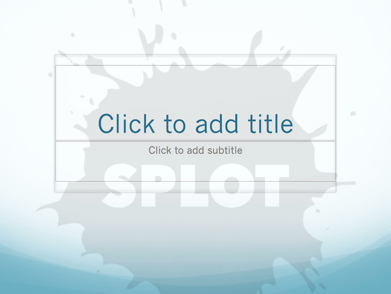
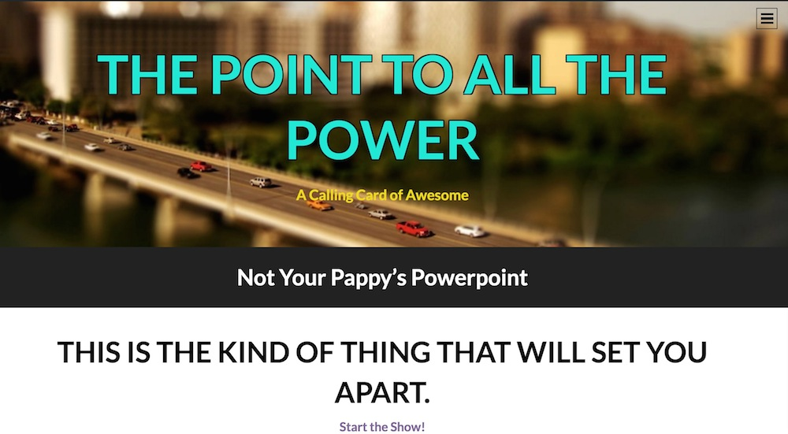
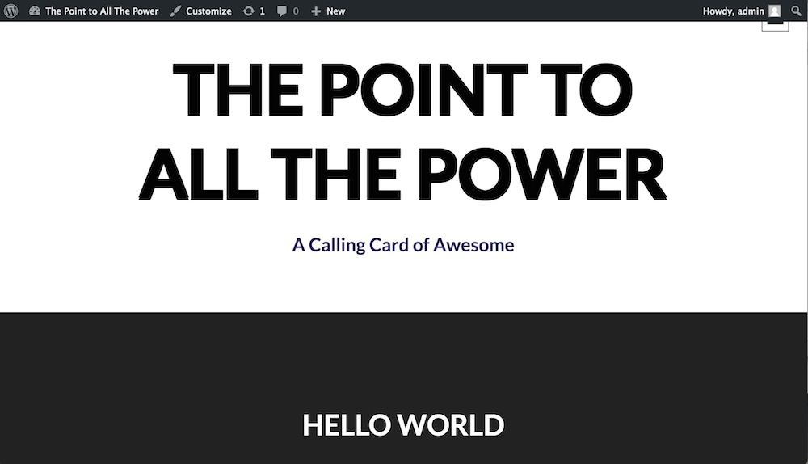
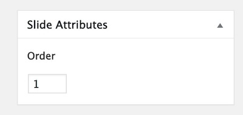
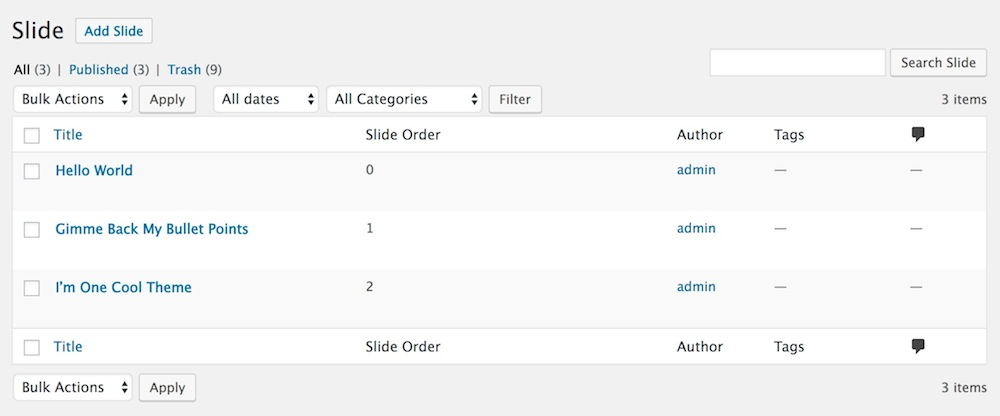
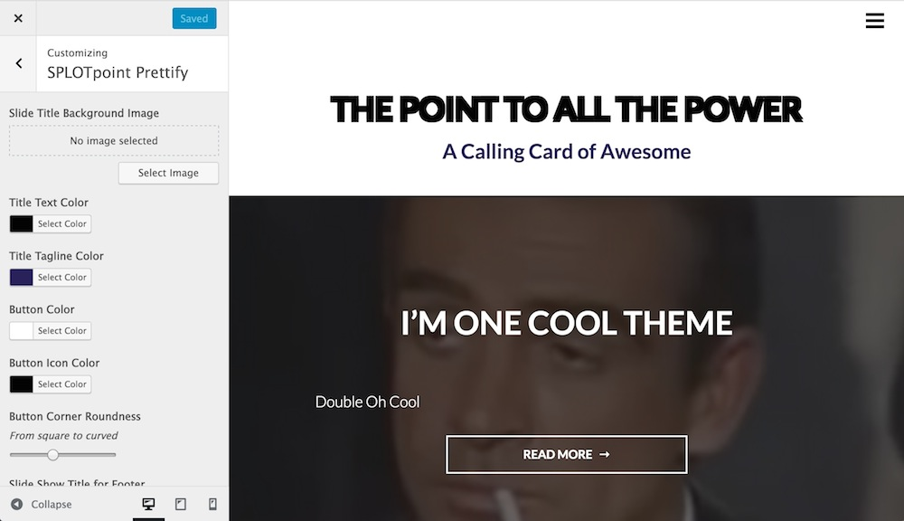
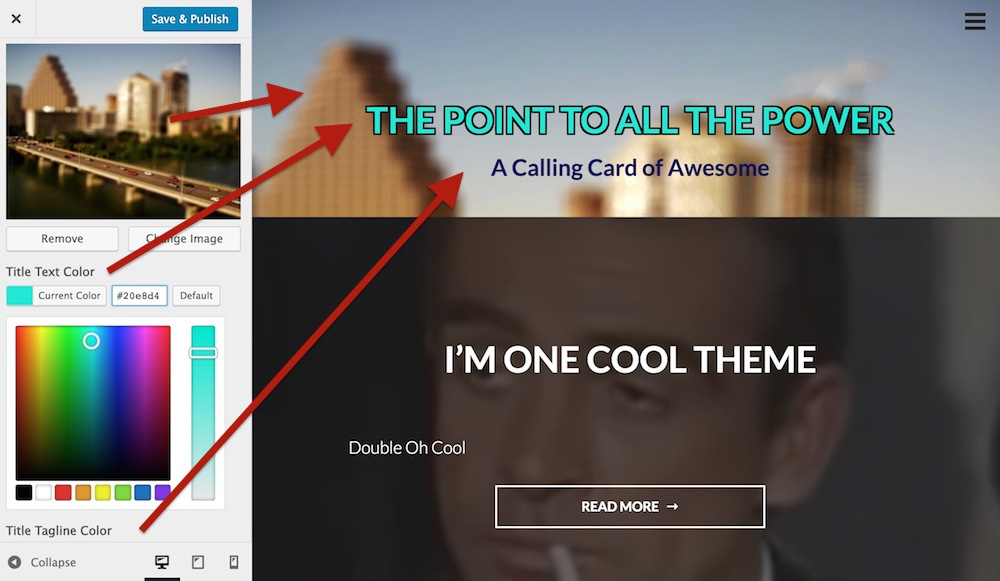
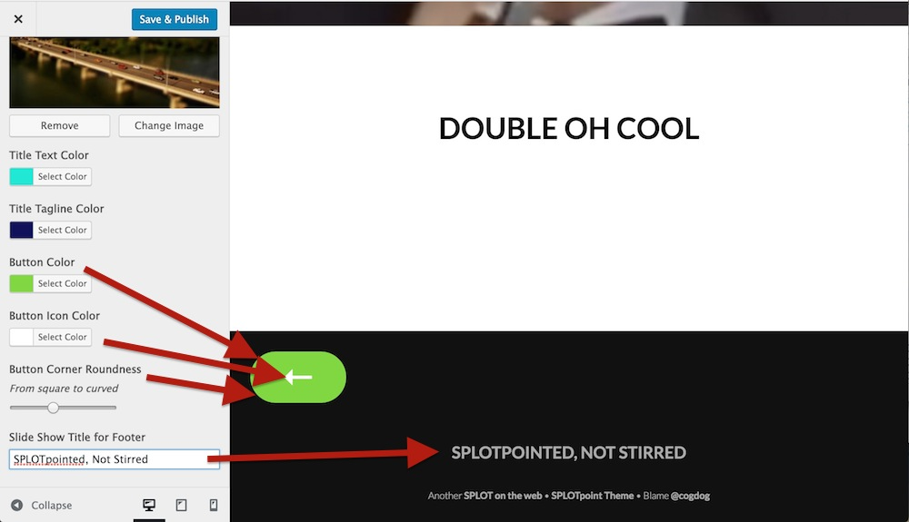
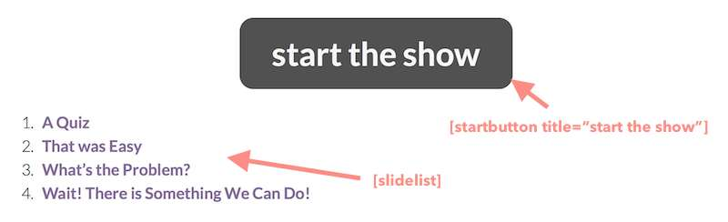

# Splotpoint
by Alan Levine http://cog.dog/ or http://cogdogblog.com/

A Wordpress-theme *SPLOT* for presenting the Cool Way (on the web)

-----
*If this kind of stuff has any value to you, please consider supporting me so I can do more!*

 

----- 

## Why Do Presentations They Same Way The Have Done it Since the 1980s?

## When You can Do Presentations as Web Native Content!

This Wordpress Theme powers a site that can be used to deliver presentations on the web, without any residue of commercial slideware. Your presentations not only look good, they also become the reference resource (e.g. additional links and info)

I developed a series of custom sites like this initially [while on a fellowship](http://cogdog.trubox.ca) at [Thompson Rivers University](http://tru.ca/) and has now been generalized as part of the collection of [SPLOT tools](http://splot.ca/).

## See It In Action

* [CNIE: Worst Learning Designs](http://cnie17.trubox.ca/)
* [Content With Content](http://show.cogdog.casa/tru-content/) - Alan Levine, Thompson Rivers University (where I bragged about making this SPLOT), March 2017
* [Doing It Web Style](https://cog.dog/roo/webstyle/) - Alan Levine, ISS Institute Tour, Australia Nov 2017
* [Fork U](http://lab.merelearning.ca/forku/) - Colin Madland, Trinity Western University
* [The Good, The Web, and The PowerPoint](http://connectedcourses.stateu.org/demo/goodbad/) - demo
* [GIFs, Memes, and Cool Web Stuff](http://show.cogdog.casa/cool/) - Alan Levine, a presentation at the Universidad del Sagrado Corazón, Feb 2016
* [Ideas for Work Showing](https://cog.dog/roo/showing-work/) - Alan Levine, ISS Institute Tour, Australia Nov 2017
* [Mozfest17 Wikipedia Games](https://ammienoot.com/mozfest17/) - Anne-Marie Scott, University of Edinburgh, October 2017
* The [NetNarr GIF Reader](http://gif.arganee.world/) - Alan Levine, Networked Narratives Class, Feb 2018
* [On Futuring](https://cog.dog/roo/futuring/) - Alan Levine, ISS Institute Tour, Australia Nov 2017
* [Open Ed Tech Cooperativism](https://oer17.opened.ca/), BC Open Ed Tech Co-Production, OER 17, April 2017
* [Picture This: Finding, Taking, and Using Photographs](http://picturethis.extendlabs.ca) - Alan Levine, Ontario Extend Summer Institute, August, 2017
* [SPLOT The OER Tools](http://module13.ca/oer-tools/) - JR Dingwall, University of Saskatchewan
* [What is Exciting? (according to Alan, YMMV)](https://cog.dog/roo/exciting/)  - Alan Levine, ISS Institute Tour, Australia Nov 2017
* [Wikipedia Basics](https://thinking.is.ed.ac.uk/wiki-basics/) - Anne-Marie Scott & Ewan McAndrew, University of Edinburgh
* [WikiData Basics](https://thinking.is.ed.ac.uk/wikidata-basics/) - Ewan McAndrew, University of Edinburgh
* [YouTube for Educators](http://nursekillam.com/youtube/) - Laura Killam and Jessica O’Reilly, CNIE 2018
* [WikiData Workshop] (https://thinking.is.ed.ac.uk/wikidata-workshop/) - Ewan McAndrew, University of Edinburgh Digital Day of Ideas, May 2018
* [Wikipedia Translation] (https://thinking.is.ed.ac.uk/wikitranslation/) - Ewan McAndrew, University of Edinburgh, Building Bridges not Walls Workshop, Celtic Knot Conference, July 2018

And if you make your own Splotpoint, please please pretty please fork this repo to edit this Readme with a link to your spiffy example (otherwise [we may just Google you and add it anyhow](https://www.google.ca/search?q="SPLOTpoint+Theme")). Or leave a message via the issues link below.

If you have problems, feature suggestions, small bags of gold coin for me, please [contact me via the issues area](https://github.com/cogdog/splotpoint/issues) on this repo.

### New Features (details below)

* May 26, 2018 Added option to the `startbutton` shortcode to start presentation at a specific slide
* May 22, 2018 Theme will now generate a `/all` a handouts page that displays all slides in one view with print styles to insert pagebreaks at the end of slides when printed
* Oct 16, 2017 Added navigation shortcuts with right, left arrow for slide navigation and up arrow to return to top
* Aug 7 2017 Shortcodes for generating a full list of slides and a start button to launch the first slide

To be done:
* Possible experiment as child theme of the newer Intergalactic-2 theme or fold the no longer updated Intergalactic 1.3.2 into Splotpoint.

## Requirements

I will make a grand assumptive leap in that you have a self hosted Wordpress site and can install themes. Splotpoint is a child theme based on [Intergalactic Theme](https://wordpress.org/themes/intergalactic).

## Setting Up from Scratch

(1) Create a fresh Wordpress site.

(3) Download the [Intergalactic theme](https://wordpress.org/themes/intergalactic) as a .zip file. In your dashboard, install it as a new theme by uploading (Wordpress has apparently decided not to make this theme available).

(4) Install the SplotPoint theme [downloaded from this repo as a .zip file](https://github.com/cogdog/splotpoint/archive/master.zip); either by uploading to your wp-content/themes directory or by direct FTPing the unzipped files to your wordpress `wp-content/theme`s directory.

(5) Activate SplotPoint as the site's theme. 

The new site will be pretty plain, Jane. Hang on.

## Installing from The Instant Mix

As a new approach for using my themes, I have set up this one as a prebuilt package that includes the theme, initial settings, plugins, and demo content. All you need to be able to do is to install a fresh Wordpress site into the location/domain you want your site.

First [download the Instant Site package file](https://github.com/cogdog/instant-splot/raw/master/noodles/splotpoint-wpress.zip) and expand the file to reveal the single `*.wpress` file.

Then follow the [Instant SPLOT directions for Using a Packaged Kit](https://github.com/cogdog/instant-splot#got-hosting-use-a-packaged-kit) to import into your new site.

Reference the directions below for customizing (but you have all the plugins it needs already installed). 

## Making Slides

In this theme Wordpress `Posts` are renamed `Slides` -- create maybe 2,3 new ones. In the Post Editor, add your title, a featured image, and use the `Slide Attribute` box on the right to designate the order your slide sits in the deck (this can be edited easily later).

For the body text of all slides, all headings will be center aligned by default.

In the Slides (Posts) Dasbboard listing, your slides  are listed in order of the Slide Attribute.
 

You can quickly modify titles and slide order via the 'Quick Edit" link that appears when you hover over a slide title.

## Customizing the Slide deck

Once you have 3 or more slides, you can "pretty" things in the Wordpress Customizer (via the `Customize` link in the Admin toolbar while viewing the site or under `Appearance - Customize` in the Wordpress Dashboard.

When the Customizer launches, click the `SPLOTPoint Prettify section`

For the Site title, you can add an image to use as a backdrop, plus change the colors of the show title and the subtitle 

You should see changes as you choose colors (or upload a new image).

Now in the right side click the title of the top "Slide" (aka Post) to open it, and scroll to the bottom.

Here you can edit the color of the buttons and edit the text displayed in the footer.

Save your changes. Jump for joy.

## Create a Landing Page

The default of your site is a normal blog post listing. Yecch.

Create a new Wordpress Page that will soon become your landing page. The title will show up in the black bar below the main image you set above. The coptent can be a description of your presentation, your name, etc whatever you want to show up front. 

Use the `[startbutton]` shortcode followed by the `[slidelist]` one to generate a button that launches the slideshow plus a dynamically generated list of links to all slides:

Publish the page.

Now launch the Customizer while this page is in view. Open the section for `Static Front Page` and change the option for Front page displays to be `a static page`. From the Front page menu, select the name of the page you just created.

Click `Save & Publish` and marvel at your slick Splotpoint. 

## Shortcodes

`[slidelist]` generates an ordered list of all slides, can be used in front landing page and/or widgets

`[slidelist count=5]` generates an ordered list of the first 5 slides.

`[slidelist count=5 offset=5]` generates an ordered list of the 5 slides starting at slide 6.

`[startbutton]` inserts a button (styled like slide navigation buttons) to launch the first slide

`[startbutton title="go"]` customizes the text on the button

`[startbutton start="4"]` start the slideshow at slide number 4

## Updating the Theme

If you have ftp/sftp access to your site (or this can be done in a cpanel file manager), simply upload the new theme files to the `wp-content/themes` directory that includes the older version theme. 

For those that lack direct file upload access or maybe that idea sends shivers down the spine, upload and activate the [Easy Theme and Plugin Upgrades](https://wordpress.org/plugins/easy-theme-and-plugin-upgrades/) plugin -- this will allow you to upload a newer version of a theme as a ZIP archive, the same way you add a theme by uploading.

