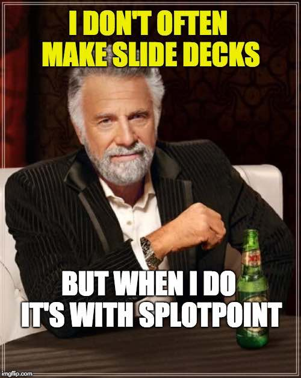

# Splotpoint
by Alan Levine http://cog.dog/ or http://cogdogblog.com/

A Wordpress-theme *SPLOT* for presenting the web way (on the web)

-----
*If this kind of stuff has any value to you, please consider supporting me so I can do more!*

 

----- 

## Why Do Presentations The Same Way It's Been Done Since the 1980s?

## When You can Do Presentations as Web Native Content!

This Wordpress Theme powers a site that can be used to deliver presentations on the web, without any residue of commercial slideware. Your presentations not only look good, they also become the reference resource (e.g. additional links and info)

## With Thanks

SPLOTs have no venture capital, no IPOs, no real funding at all. But they have been helped along by a few groups worth recognizing with an icon and a link.

SPLOTPoint was inspired by web-based presentations created during [Thompson Rivers University Open Learning Fellowship](http://cogdog.trubox.ca/) and the first version was developed independently a few years later. Further development was supported in part by a [Reclaim Hosting Fellowship](http://reclaimhosting.com), an [OpenETC grant](https://opened.ca), and ongoing support by [Patreon patrons](https://patreon.com/cogdog).

       

I developed a series of custom sites like this initially [while on a fellowship](http://cogdog.trubox.ca) at [Thompson Rivers University](http://tru.ca/) and has now been generalized as part of the collection of [SPLOT tools](http://splot.ca/).

## See It In Action

* [A 15-Minute Crash Course - Note-Taking](https://create.twu.ca/notetaking101/) Trinity Western University
* [Adaptive Tools and Creating Accessible Content](https://accessibility.jadin.me/) Taylor Jadin's workshop at the T3 conference May 2018
* [An Intro To Domain Of One’s Own](http://coventry.domains/dooo/) Coventry University
* [At The Scale of Care](https://coventry.domains/scale-of-care/) #OER20 presentation Lauren Heywood, Jim Groom, and Noah Mitchell
* [Blogging to Build your Professional Profile](https://thinking.is.ed.ac.uk/professional-blogging/) Lorna M. Campbell, University of Edinburgh
* [CNIE: Worst Learning Designs](http://cnie17.trubox.ca/)
* [Content With Content](http://show.cogdog.casa/tru-content/) - Alan Levine, Thompson Rivers University (where I bragged about making this SPLOT), March 2017
* [Digital + ](http://show.cogdog.casa/digital/) - Alan Levine, ECS100 talk, University of Regina, Mar, 2019
* [Doing It Web Style](https://cog.dog/roo/webstyle/) - Alan Levine, ISS Institute Tour, Australia Nov 2017
* [EDUPUNK, EDUBAUHAUS, D.I.O?](http://udg.theagoraonline.net/ciinovapp/)
* [Fork U](http://lab.merelearning.ca/forku/) - Colin Madland, Trinity Western University
* [The Good, The Web, and The PowerPoint](http://connectedcourses.stateu.org/demo/goodbad/) - demo
* [GIFs, Memes, and Cool Web Stuff](http://show.cogdog.casa/cool/) - Alan Levine, a presentation at the Universidad del Sagrado Corazón, Feb 2016
* [Ideas for Work Showing](https://cog.dog/roo/showing-work/) - Alan Levine, ISS Institute Tour, Australia Nov 2017
* [Ingredients for a Successful Online Class](https://module13.ca/ingredients/) - JR Dingwall
* [Mozfest17 Wikipedia Games](https://ammienoot.com/mozfest17/) - Anne-Marie Scott, University of Edinburgh, October 2017
* The [NetNarr GIF Reader](http://gif.arganee.world/) - Alan Levine, Networked Narratives Class, Feb 2018
* [Not So Stupid WordPress Tricks](http://show.cogdog.casa/pressed19/) - Alan Levine, 2019 PressEd Conference, Apr 2019
* [On Futuring](https://cog.dog/roo/futuring/) - Alan Levine, ISS Institute Tour, Australia Nov 2017
* [Open Ed Tech Cooperativism](https://oer17.opened.ca/), BC Open Ed Tech Co-Production, OER 17, April 2017
* [The 'Pedia and Beyond](https://muraludg.org/pedia/), Mural UDG Project, Guadalajara, March 2018
* [Picture This: Finding, Taking, and Using Photographs](http://picturethis.extendlabs.ca) - Alan Levine, Ontario Extend Summer Institute, August, 2017
* [Practable](https://beardyprof.com/practable/) Non-Traditional Practical Work for Everyone - Tim Drysdale
* [SEO: Search Engine Optimization for personal websites](https://slides.jadin.me/seo/) - Taylor Jardin
* [Social Annotation](https://social.techforteaching.ca/blog/) Reading Out Loud by Jesslyn Wilkinson
* [SPLOT The OER Tools](http://module13.ca/oer-tools/) - JR Dingwall, University of Saskatchewan
* [SPLOTS? HUH?](https://cte.openlcc.net/courses/splots/) - A CTE NOOC about SPLOTS! by Jim Luke
* [UMASS Create](https://samanderson.umasscreate.net/present/) - A Web Domains Pilot at UMass Amherst
* [What is Exciting? (according to Alan, YMMV)](https://cog.dog/roo/exciting/)  - Alan Levine, ISS Institute Tour, Australia Nov 2017
* [Wikipedia Basics](https://thinking.is.ed.ac.uk/wiki-basics/) - Anne-Marie Scott & Ewan McAndrew, University of Edinburgh
* [WikiData Basics](https://thinking.is.ed.ac.uk/wikidata-basics/) - Ewan McAndrew, University of Edinburgh
* [YouTube for Educators](http://nursekillam.com/youtube/) - Laura Killam and Jessica O’Reilly, CNIE 2018
* [WikiData Workshop](https://thinking.is.ed.ac.uk/wikidata-workshop/) - Ewan McAndrew, University of Edinburgh Digital Day of Ideas, May 2018
* [Wikipedia Translation](https://thinking.is.ed.ac.uk/wikitranslation/) - Ewan McAndrew, University of Edinburgh, Building Bridges not Walls Workshop, Celtic Knot Conference, July 2018

And if you make your own Splotpoint, please please pretty please fork this repo to edit this Readme with a link to your spiffy example (otherwise [we may just Google you and add it anyhow](https://www.google.ca/search?q="SPLOTpoint+Theme")). Or leave a message via the issues link below.

If you have problems, feature suggestions, small bags of gold coin for me, please [contact me via the issues area](https://github.com/cogdog/splotpoint/issues) on this repo.

## Requirements

I will make a grand assumptive leap in that you have a self hosted Wordpress site and can install themes. Splotpoint is a child theme based on [Intergalactic Theme](https://wordpress.org/themes/intergalactic).

## Installing SPLOTpoint

Using this theme requires a self-hosted--or institutionally hosted (lucky you)-- Wordpress site (the kind that you download from [wordpress.org](http://www.wordpress.org). You cannot use this theme on the free "wordpress.com" site unless you have a business plan. Maybe check out [Reclaim Hosting](https://reclaimhosting.com/) if you choose to set up your own hosting space. 

SPLOTpoint is a child theme based on [Intergalactic theme](https://wordpress.org/themes/intergalactic). Install this theme first from within the Wordpress Dashboard under **Appearance** -- **Themes** searching on `Intergalactic`.

### Installing SPLOTpoint from Scratch

You can download a ZIP file of this theme via the green **Code*" button above (use the Download Zip option). 

The zip can be uploaded directly to your site via **Themes** in the Wordpress dashboard, then **Add Theme** and finally **Upload Theme**. If you run into size upload limits or just prefer going old school like me, unzip the package and ftp the entire folder into your `wp-content/themes` directory.

### Updating SPLOTpoint (manually)

As of WordPress version 5.5, themes uploaded as .ZIP files can now be updated the same way you installed it. Just download the newest version, and update it by going to **Themes** in the Wordpress dashboard, then **Add Theme** and finally **Upload Theme**. You will be asked to confirm updating the theme with the newer version.  

### Installing SPLOTpoint in One Click with WP Pusher (get automatic updates!)

To have your site stay up to date automatically, I recommend trying the [WP Pusher plugin](https://wppusher.com/) which makes it easier to install themes and plugins that are published in GitHub. It takes a few steps to set up, but it's the most direct way to get updates to the theme.

To use WP-Pusher you will need to have or create an account on [GitHub](https://github.com/) (free). Log in. 

Next [download WP Pusher plugin](https://wppusher.com/download) as a ZIP file. From the plugins area of your Wordpress dashboard, click the **Upload Plugin** button, select that zip file to upload, and activate the plugin.

Then click the **WP Pusher** option in your Wordpress Dashboard, and then click the **GitHub** tab. Next click the **Obtain a GitHub Token** button to get an authentication token. Copy the one that is generated, paste into the field for it, and finally, click **Save GitHub** Token.

Now you are ready to install SPLOTpoint! 

Look under **WP Pusher** for **Install Theme**. In the form that appears, under **Theme Repository**, enter `cogdog/splotpoint`. Also check the option for **Push-to-Deploy** (this will automatically update your site when the theme is updated) finally, click **Install Theme**.

Woah Neo?

Not only does this install the theme without any messy download/uploads, each time I update the theme on GitHub, your site will be automatically updated to the newest version.  

## Loosely Referred to as Documentation

### Making Slides

In this theme Wordpress `Posts` are renamed `Slides` -- create maybe 2,3 new ones. In the Post Editor, add your title, a featured image, and use the `Slide Attribute` box on the right to designate the order your slide sits in the deck (this can be edited easily later).

For the body text of all slides, all headings will be center aligned by default.

In the Slides (Posts) Dasbboard listing, your slides  are listed in order of the Slide Attribute.
 

You can quickly modify titles and slide order via the 'Quick Edit" link that appears when you hover over a slide title.

### Customizing the Slide deck

Once you have 3 or more slides, you can "pretty" things in the Wordpress Customizer (via the `Customize` link in the Admin toolbar while viewing the site or under `Appearance - Customize` in the Wordpress Dashboard.

When the Customizer launches, click the `SPLOTPoint Prettify` section

For the Site title, you can add an image to use as a backdrop, plus change the colors of the show title and the subtitle 

You should see changes as you choose colors (or upload a new image).

Now in the right side click the title of the top "Slide" (aka Post) to open it, and scroll to the bottom.

Here you can edit the color of the buttons and edit the text displayed in the footer.

Save your changes. Jump for joy.

### Create a Landing Page

The default of your site is a normal blog post listing. Yecch.

Create a new Wordpress Page that will soon become your landing page. The title will show up in the black bar below the main image you set above. The coptent can be a description of your presentation, your name, etc whatever you want to show up front. 

Use the `[startbutton]` shortcode followed by the `[slidelist]` one to generate a button that launches the slideshow plus a dynamically generated list of links to all slides:

Publish the page.

Now launch the Customizer while this page is in view. Open the section for `Static Front Page` and change the option for Front page displays to be `a static page`. From the Front page menu, select the name of the page you just created.

Click `Save & Publish` and marvel at your slick Splotpoint. 

## All Shortcodes

`[slidelist]` generates an ordered list of all slides, can be used in front landing page and/or widgets

`[slidelist count=5]` generates an ordered list of the first 5 slides.

`[slidelist count=5 offset=5]` generates an ordered list of the 5 slides starting at slide 6.

`[startbutton]` inserts a button (styled like slide navigation buttons) to launch the first slide

`[startbutton title="go"]` customizes the text on the button

`[startbutton start="4"]` start the slideshow at slide number 4

### New Features (details below)

* June 9, 2021 Button code better on small screens, adjusted entry width to fill better for embedded videoå
* May 26, 2018 Added option to the `startbutton` shortcode to start presentation at a specific slide
* May 22, 2018 Theme will now generate a `/all` a handouts page that displays all slides in one view with print styles to insert pagebreaks at the end of slides when printed
* Oct 16, 2017 Added navigation shortcuts with right, left arrow for slide navigation and up arrow to return to top
* Aug 7 2017 Shortcodes for generating a full list of slides and a start button to launch the first slide

